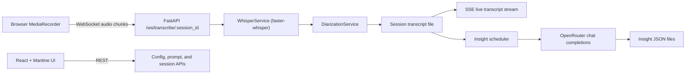

# LocalRiskInsights

LocalRiskInsights is a Docker-first, single-user web application for recording live audio, generating rolling transcript files, and turning those transcripts into risk-focused insights with OpenRouter models.

The repository ships as a FastAPI backend plus a React + Vite frontend. Sessions and insight snapshots are stored on disk, so the app stays simple to run locally without adding a database.

## Project Overview

- Live browser audio capture streams `audio/webm` chunks to FastAPI over WebSockets.
- `faster-whisper` handles transcription on the backend.
- A local diarization service is included with an honest fallback: without an offline diarization model path, segments are tagged as `Speaker 1`.
- Transcript files are written to `data/sessions/`.
- Insight files are written to `data/insights/`.
- OpenRouter configuration is managed from the UI and persisted through `.env` plus `data/config.local.yaml`, with `config.yaml` kept as the tracked repo default.

## Quick Start (Docker)

1. Create your environment file:

```bash
cp .env.example .env
```

2. Add your `OPENROUTER_API_KEY` to `.env`.

3. Build and run the app:

```bash
docker compose up --build
```

4. Open [http://localhost:8000](http://localhost:8000).

## macOS Double-Click Launcher

For a Finder-friendly macOS launch path using Docker Desktop, use the files in [macos](/Users/hpatel/Codex/WebApp-Transcribe-and-Prompt/macos):

- [Launch-LocalRiskInsights.command](/Users/hpatel/Codex/WebApp-Transcribe-and-Prompt/macos/Launch-LocalRiskInsights.command)
- [Stop-LocalRiskInsights.command](/Users/hpatel/Codex/WebApp-Transcribe-and-Prompt/macos/Stop-LocalRiskInsights.command)
- [START-HERE-MACOS.txt](/Users/hpatel/Codex/WebApp-Transcribe-and-Prompt/macos/START-HERE-MACOS.txt)

The macOS user can:

1. Install Docker Desktop for Mac
2. Double-click `Launch-LocalRiskInsights.command`
3. Paste their OpenRouter API key if prompted
4. Wait for the build and startup to finish
5. Use the app at `http://127.0.0.1:8000`

To stop the app later, double-click `Stop-LocalRiskInsights.command`.

## Windows Package

For non-technical Windows users, you can generate a starter zip that includes double-click launch scripts:

```bash
python scripts/build_windows_bundle.py
```

That creates:

- `dist/LocalRiskInsights-Windows/`
- `dist/LocalRiskInsights-Windows.zip`

Inside the zip, the Windows user can:

1. Install and start Docker Desktop
2. Double-click `Launch-LocalRiskInsights.bat`
3. Paste their OpenRouter API key when prompted
4. Open `http://localhost:8000`

To stop the app later, they can double-click `Stop-LocalRiskInsights.bat`.

## Windows Portable Zip

If the Windows user does not want Docker Desktop, generate the portable zip instead:

```bash
python scripts/build_windows_portable_bundle.py
```

That creates:

- `dist/LocalRiskInsights-Windows-Portable/`
- `dist/LocalRiskInsights-Windows-Portable.zip`

The portable bundle includes:

- a prebuilt frontend served from FastAPI
- the application source
- a bundled Windows embeddable Python 3.11.9 zip
- a bundled `pip.pyz`
- a bundled FFmpeg essentials zip
- a local wheelhouse of Windows Python dependencies
- double-click launch and stop scripts

The Windows user can then:

1. Unzip `LocalRiskInsights-Windows-Portable.zip`
2. Double-click `Launch-LocalRiskInsights-Portable.bat`
3. Paste their OpenRouter API key
4. Wait for first-run setup to finish
5. Use the app at `http://127.0.0.1:8000`

This portable path does not require Docker Desktop, Python, or Node on the Windows machine.
The first actual transcription may still download the Whisper model into the portable runtime cache.

## Configuration

`config.yaml` stores the committed repo defaults for non-secret settings:

- OpenRouter API base
- Selected default model
- Allowed model list
- Free-only vs paid routing
- Transcription chunk size
- Insight interval
- Storage directories

`data/config.local.yaml` stores machine-local overrides written by the UI:

- Selected default model
- Allowed model list
- Free-only vs paid routing
- Any other non-secret settings you save from the Config tab

If `data/config.local.yaml` does not exist yet, the app falls back to `config.yaml`.

`.env` stores secrets:

- `OPENROUTER_API_KEY`

The Config tab lets you:

- Save or update the OpenRouter API key
- Choose the default model
- Toggle paid model routing on or off
- Refresh the available model list from OpenRouter

The seeded model defaults are free model IDs current as of April 6, 2026. Use the refresh button in the UI to update them against the live OpenRouter catalog.

## Architecture Diagram



## Development

### One-command startup

After installing backend and frontend dependencies once, start both dev servers together with:

```bash
python scripts/dev.py
```

On Windows, the equivalent is:

```bash
py scripts/dev.py
```

The launcher starts:

- FastAPI on `http://127.0.0.1:8000`
- Vite on `http://127.0.0.1:5173`

You can override ports if needed:

```bash
python scripts/dev.py --backend-port 9000 --frontend-port 5174
```

### Backend

```bash
python -m venv .venv
source .venv/bin/activate
pip install -e ".[dev]"
uvicorn app.main:app --reload --host 0.0.0.0 --port 8000
```

### Frontend

```bash
cd frontend
npm install
npm run dev
```

The Vite dev server proxies `/api` and `/ws` traffic to the FastAPI backend on port `8000`.

### Tests

```bash
pytest
```

## Notes on Diarization

This repository intentionally does not require a Hugging Face token.

If you want stronger diarization locally, point `transcription.local_diarization_model_path` in `data/config.local.yaml` at a locally available `pyannote.audio` pipeline directory and install the optional extra. If you want that path committed as a repo default instead, edit `config.yaml`:

```bash
pip install -e ".[diarization]"
```

Without that local model path, the app still works end-to-end and marks transcript lines with a single-speaker fallback label.

## License

MIT. See [LICENSE](./LICENSE).
